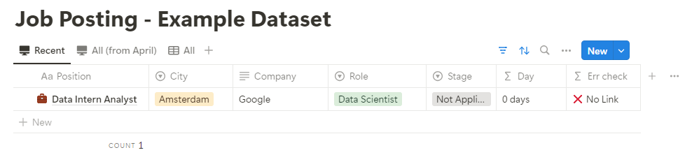

# Notion CV Updater

Update the CV from a job posting.

## How it works

**Create a new Dataset**: You can you the [template](https://marcodifrancesco.notion.site/8993d6d12560487fbfa2ebd3e93962ad?v=f10b880e1c0f472981705bfbbcb066b6&pvs=4).

<div style="max-width: 500px;">
    
</div>

**Create a new Job Posting**: job posting contains inside the full job description.

**Underline your skills**: make in bold your skill, for example including technologies (e.g. “PySpark”) and tasks (e.g. “data mining”).

<div style="max-width: 500px;">
    
</div>

## Setup API

```bash
python3.10 -m venv .venv
```

- **Get API key**: from [Notion Integrations](https://developers.notion.com/docs/create-a-notion-integration#getting-started).

- **Rename**: `.env.example` -> `.env`. Place here the API key.

<div style="max-width: 300px;">
    
</div>

- **Run the notebook**